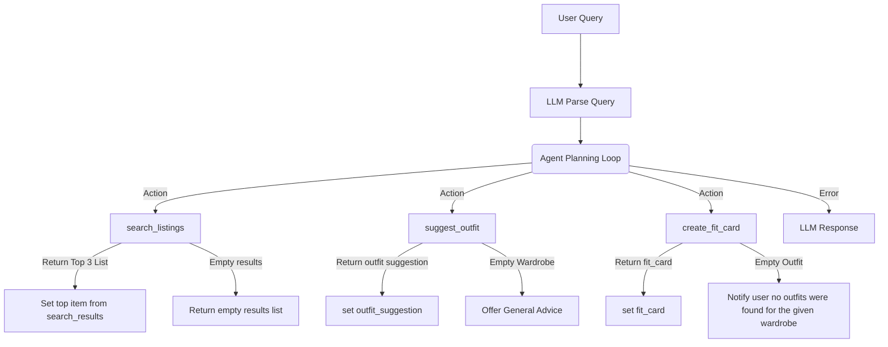

# FitFindr — planning.md

> Complete this document before writing any implementation code.
> Your spec and agent diagram are what you'll use to direct AI tools (Claude, Copilot, etc.) to generate your implementation — the more specific they are, the more useful the generated code will be.
> Your planning.md will be reviewed as part of your submission.
> Update it before starting any stretch features.

---

## Tools

List every tool your agent will use. For each tool, fill in all four fields.
You must have at least 3 tools. The three required tools are listed — add any additional tools below them.

### Tool 1: search_listings

**What it does:**

The agent will be given parsed information such as the string description of the user query, a letter string of commoon sizes of the item in question, and the max price in decimal if given. This function will query a list of dicts of clothing items from the wardrobe list and filter based on the size/price and return the top 3 matching items sorted by relevance from the top matching listings found in the database based on the description.

**Input parameters:**
<!-- List each parameter, its type, and what it represents -->
- `description` (str): This is the main item description of the query
- `size` (str): This is the alpha sizing of the item from the description
- `max_price` (float): This is the price range of the query, use this as an estimate or none if given.

**What it returns:**
The return will a list of dicts containing the top 3 items based on the relevance of the description with fields (id, title, description, category, style_tags (list), size condition, price (float), colors (list), brand, platform)

**What happens if it fails or returns nothing:**
If no listing is found, prompt the agent to recommend the user to try a different query or expand their query.

---

### Tool 2: suggest_outfit

**What it does:**
    Given the new item dict and the user's wardrobe as a list, ask the LLM to suggest outfits combinations.

**Input parameters:**
<!-- List each parameter, its type, and what it represents -->
- `new_item` (dict): The dict of the item the user is interested in
- `wardrobe` (dict): A dict with an items list that contains the keys: id, name, category, colors, style_tags, and notes with their respective values.

**What it returns:**
     This function returns string with outfit suggestions matching their new_item with their wardrobe.

**What happens if it fails or returns nothing:**
     If the user's wardrobe is empty recommend general stying advice and recommendations. Do not throw any errors or exceptions and do not return empty strings.

---

### Tool 3: create_fit_card

**What it does:**
    Create a short shareable outfit caption for the item found thrifting! This caption may be shared by the user online and with friends/family.

**Input parameters:**
<!-- List each parameter, its type, and what it represents -->
- `outfit` (str): The recommended outfit description from the suggest_outfit output
- `new_item` (dict): The dict of the item that user is interested in

**What it returns:**
     A string of a few sentences that can be used as an Instagram/TikTok/Subreddit Outfit of the Day caption. Keep it personalized for the user and ensure to mention the brand, item name, price, and platform naturally.

**What happens if it fails or returns nothing:**
     If outfit is empty or missing, return a descriptive error message
     string — do NOT raise an exception during any failure.

---

### Additional Tools (if any)

N/A

---

## Planning Loop

**How does your agent decide which tool to call next?**
<!-- Describe the logic your planning loop uses. What does it look at? What conditions change its behavior? How does it know when it's done? -->

A new session will be created with the parameters specified in the new_session return dict. The user's query is then is parsed for the information: (a description, size, and max_price) by the LLM, save this in the session object's parsed_query parameters along with the returns from the tools as specified. To start create an agent loop there are 3 functions tools that can be called by the agent search_listings, suggest_outfit, or create_fit_card. These are not called in order, instead the agent will decide what function to call based on the tools given to the LLM.

The search_listings is ran with (description, size, max_price) and returns a list of dict from the items. If empty returns an empty list and do not error out. If the agent receives the empty list prompt recommendations to improve the user's query. The topmost item set in the session selected_item.

If a suggestion is needed use the suggest_outfit(new_item, wardrobe) along with the user's wardrobe. This function will use the LLM and return a string outfit suggetsion based on the existing wardrobe and the new_item. If the wardrobe is empty note this and offer general advice for outfits. This return will also be saved onto the session's outfit_suggestion.

For the create_fit_card(outfit_suggestion, selected_item) it will take the suggestion string and the item to create a personalized caption post that can be shared on posts and medias describing the user's outfit such as price, where they found it, and the item description. This return will be saved in the fit_card and will complete the session/loop.

---

## State Management

**How does information from one tool get passed to the next?**
<!-- Describe how your agent stores and accesses state within a session. What data is tracked? How is it passed between tool calls? -->
- The state is managed by the session object we create that will allow us to save data such as the new_item and pass it along the tools and the output from one function to another.

---

## Error Handling

For each tool, describe the specific failure mode you're handling and what the agent does in response.

| Tool | Failure mode | Agent response |
|------|-------------|----------------|
| search_listings | No results match the query | Notify the user that no items matched the query and recommend the user to use less filters based on their query. |
| suggest_outfit | Wardrobe is empty | If the wardrobe is empty use the LLM to give general advice but also note that the user's wardrobe is miminal to create suggestive outfits |
| create_fit_card | Outfit input is missing or incomplete | Notify the user that there was not a great outfit suggestion based on their current wardrobe and to try expanding their input. |

---

## Architecture

<!-- Draw a diagram of your agent showing how the components connect:
     User input → Planning Loop → Tools (search_listings, suggest_outfit, create_fit_card)
                                                                          ↕
                                                                   State / Session
     Show what triggers each tool, how state flows between them, and where error paths branch off.
     Use ASCII art or a Mermaid diagram (https://mermaid.js.org/syntax/flowchart.html).
     Do NOT embed an image — graders need to read your diagram directly in the file;
     an embedded image or screenshot cannot be evaluated.
     You'll share this diagram with an AI tool when asking it to implement
     the planning loop and each individual tool. -->
Mermaid Diagram:

---

## AI Tool Plan

<!-- For each part of the implementation below, describe:
     - Which AI tool you plan to use (Claude, Copilot, ChatGPT, etc.)
     - What you'll give it as input (which sections of this planning.md, your agent diagram)
     - What you expect it to produce
     - How you'll verify the output matches your spec before moving on

     "I'll use AI to help me code" is not a plan.
     "I'll give Claude my Tool 1 spec (inputs, return value, failure mode) and ask it to implement
     search_listings() using load_listings() from the data loader — then test it against 3 queries
     before trusting it" is a plan. -->

**Milestone 3 — Individual tool implementations:**

Ill be using Claude and Ill pass it my interaction plan and my Tool 1 search_listings from planning.md and ask it on the Plan mode before any code is auto generated to create a step prodecure for the function using load_listings() from utils/data_loader.py. If the load_listings is empty ensure to handle based on my plan. Ill also ask it to filter based on the price, size, and description before passing the information to the LLM. Ill then ask to create a test folder with 3 separate function to test the filters and the output assertions. Focus only on modifying the function and do not change the parameters or return or anything outside the scope unless needed.

For suggest_outfit, ill ask Claude to my spec and the LLM - Groq llama-3.3-70b-versatile with my API key from the .env to suggest an outfit description using my wardobe and the new_item. If the wardrobe is empty give general advice instead for the prompt. This will also have a test file in the test folder with simple cases for the empty wardrobe.

For create_fit_card, Ill also ask Clause to use the the same LLM - Groq to create a caption based on my spec plan and handle the empty outfit scenario. This will also have a test file in the test folder the error and also for testing the LLM output to ensure it is not the same. If the output is quite similar then adjust the LLM temperature.

**Milestone 4 — Planning loop and state management:**

---

## A Complete Interaction (Step by Step)

Write out what a full user interaction looks like from start to finish — tool call by tool call. Use a specific example query.

**Example user query:** "I'm looking for a vintage graphic tee under $30. I mostly wear baggy jeans and chunky sneakers. What's out there and how would I style it?"

**Step 1:**

- The agent will be given parsed information such as the string description of the query, letter size of the item in question, and the max price in decimal to decide from the 3 tools and run any of the tools such as the search_listing functions which queries a database of clothing items. The function search_listing will return the top matching items sorted by relevance from the top 3 matching listings found in the database.

From example: search_listings(description: "vintage graphic tee", size="M", max_price=30.0)

returns: An list of dicts from the listings that matches the query.

**Step 2:**

- Given the top selected item from search_listing the agent will decide to call suggest_outfit with the item, and pass in a list of wadrobe objects. This function will return an outfit suggestion with the new item and the existing wardrobe.

From Example: suggest_outfit(new_item=object_from_database, wardrobe=objects_from_user_wardrobe)

Return: A description recommendation of what pairs with the item if any.

**Step 3:**

- The create_fit_card will take the return of suggest_outfit output and the new item to create a "Outfit of the Day" description personalized for the user that can be shared online.

From Example: create_fit_card(outfit_desc_recomm, new_item)

Return: An output personalized for the user to share with friends, family, and online of the new item they purchased.

Errors:

- If search_listings returns nothing, do not recommend anything and do not call suggest_outfit. Notify the user to try their input differently based on their wardrobe.
- If the user has an empty or small wardrobe that cannot have a good fit with their new item notify them of this and do not call create_fit_card.

**Final output to user:**
<!-- What does the user actually see at the end? -->
